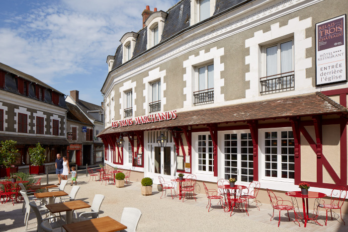
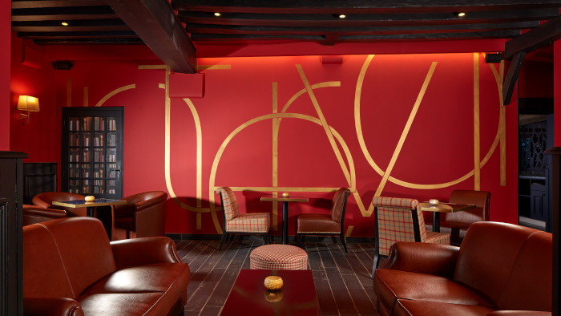

# Accomodation

<!-- MACRO{snippet|debug=false|ignoreDownloadError=false|verbatim=false|file=src/site/resources/fragments/breadcrum.snippet.html} -->

JChateau® is held in the [Relais des trois chateaux](https://www.relaisdestroischateaux.com/), a hotel and conference center conveniently located less than 20 minutes’ drive from the most beautiful castles of the Loire Valley: Blois, Chambord. Cheverny is within walking distance. This is in the middle of the Châteaux of the Loire Valley, designated as a World Heritage Site by UNESCO in 2000.

The [Relais des trois chateaux](https://www.relaisdestroischateaux.com/) hotel has been created in an ancient building in the middle of the Cour-Cheverny village. 

The sessions of the unconference will be held in the hotel meeting rooms.

Lunches and dinners on-site will be served in the hotel's restaurant.

Discussion can also take place in more relaxing places than regular meeting rooms, if this is what you prefer!

