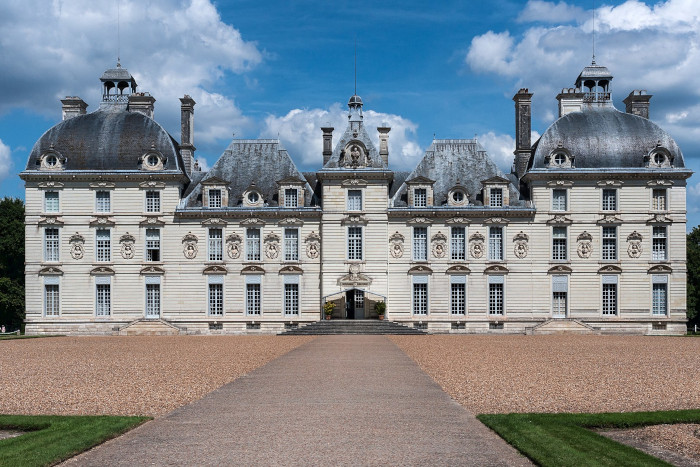
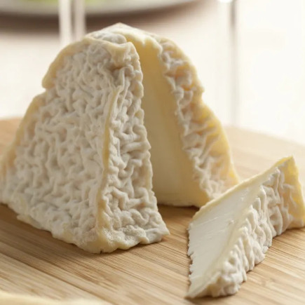
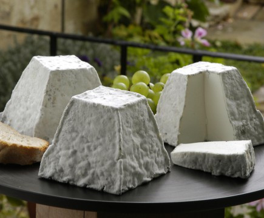

# Excursions

<!-- MACRO{snippet|debug=false|ignoreDownloadError=false|verbatim=false|file=src/site/resources/fragments/breadcrum.snippet.html} -->

We plan to propose several visits to discover the beautiful region "Châteaux de la Loire". We are still in the process of scheduling everything, here is what we have in mind. Our friend [Denys](https://twitter.com/denis_makogon) made a beauitiful video of the region. 

## Some of our current thought

* [Château de Cheverny](https://www.chateau-cheverny.fr/)

The Château de Cheverny is in the village our hotel is, withing walking distance. This chateau inspired Hergé when he created the Chateau de Moulinsart for the Tintin adventures. It is definitely we plan to visit.  

* [Château de Chambord](https://en.wikipedia.org/wiki/Ch%C3%A2teau_de_Chambord)

We already visited the Château de Chambord for the first edition in 2019. It was a great success, and many people who couldn't make three years ago asked to do it again. So we may also do that.  

* Wine cellar visit, goat cheese tasting

The whole region is also famous for two other things: goat cheese and wine, both red and wine. Visiting a cellar and having some local wine tasting is definitely something we plan to do. 

 

 

