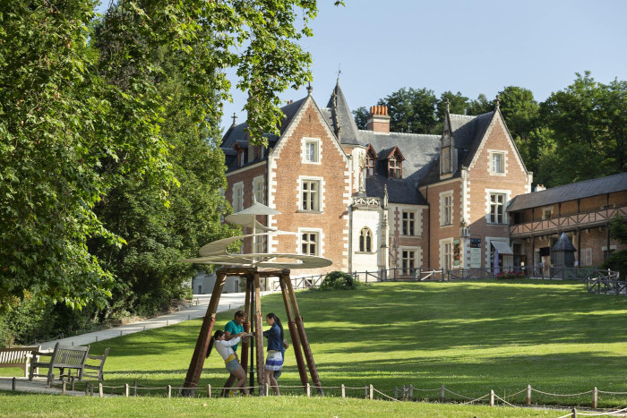
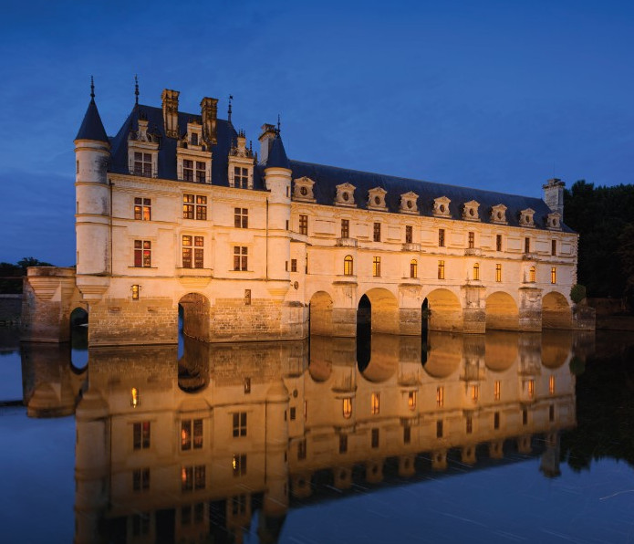
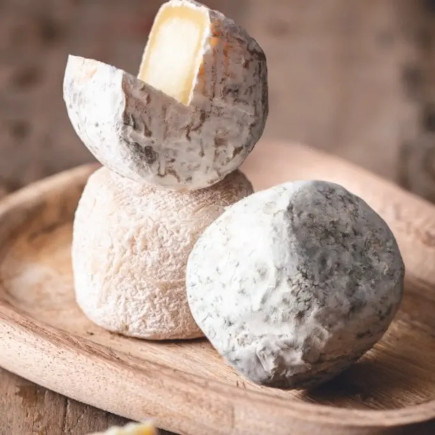

# Excursions

<!-- MACRO{snippet|debug=false|ignoreDownloadError=false|verbatim=false|file=src/site/resources/fragments/breadcrum.snippet.html} -->

We plan to propose several visits to discover the beautiful region "Châteaux de la Loire". We are still in the process of scheduling everything, here is what we have in mind. Our friend [Denys](https://twitter.com/denis_makogon) made a beauitiful video of the region. 

## Some of chateaux we visited the previous years

* [Château de Cheverny](https://www.chateau-cheverny.fr/)

The Château de Cheverny is in the village our hotel is, withing walking distance. This chateau inspired Hergé when he created the Chateau de Moulinsart for the Tintin adventures. It is definitely we plan to visit.  

* [Château de Chambord](https://en.wikipedia.org/wiki/Ch%C3%A2teau_de_Chambord)

The Château de Chambord is the biggest château in Europe. Built between 1519 and 1547 by François Ier, it is a visit that we organize every year. Impossible to miss this iconic place when you visit the region!  

* [Clos Lucé](https://vinci-closluce.com/en)

The Clos Lucé is the château where Leonardo spent the last three years of his life. He worked on many things there, including the Mona Lisa, now in Le Louvre. 

* [Château de Chenonceau](https://www.chenonceau.com/)

Chenonceau was built in 1513. In reference to the large number of female figures who have been in charge of it, it is nicknamed "the Ladies' Castle". Its unique location over the river Cher makes a very picturesque location. 

* [Château de Blois](https://www.chateaudeblois.fr/)

The Château de Blois has a rich history that dates back to the 13th century. Renowned for its beautiful blend of medieval, Gothic, and Renaissance styles, it was once home to French kings and queens. The magnificent halls, picturesque courtyards, and beautifully preserved chambers, tell the story of royal power and artistic innovations of the time.

* Wine cellar visit, goat cheese tasting

The whole region is also famous for two other things: goat cheese and wine, both red and wine. Visiting a cellar and having some local wine tasting is definitely something we plan to do (in the order: Crottin de Chavignol, Pouligny Saint Pierre, Sainte Maure, Selles sur Cher, and Valençay. One day I'll understand how captions are working in markdown). 

 

 

