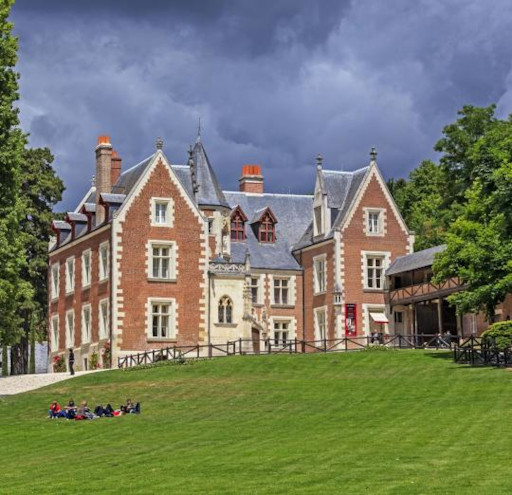

# What is JChateau?

From March 11th to March 15th 2020, the unconference JChateau will take place in Amboise, [Villa Bellagio](https://vbamboise.popinns.com/), in the middle of the Château of the Loire Valley. Check the registrations available, some of them include staying at the Villa Bellagio at discount prices. 

[Accomodation](accommodation.html) | [Travel](travel.html) | [Schedule](schedule.html) | [What is an unconference?](what-is-an-unconference.html)
 
[Registration infos](registrationinfo.html) | [Registration](https://www.helloasso.com/associations/bjpc/evenements/jchateau/widget) | [Team](the-team.html)

Need any assistance? Please drop us an email at [contact@jchateau.org](mailto:team@jchateau.org).

## First answer: an unconference

<<<<<<< HEAD
JChateau® is an **Unconference** organized in France in the iconic area of the Châteaux of the Loire Valley, designated as a World Heritage Site by UNSECO in 2000. The people behind this event are the same that have been organizing the Paris Java User Group meet-ups for about 10 years.
***But this year we go Virtual***.

## Second answer: a non-profit event

Everything has a price, and organizing such an event has one too. So unfortunately, attending JCHateau cannot be free. Despite that, it is still a non-profit event, organized by the same non-profit association that has been organizing the Paris Java User Group meet-ups for the past 5 years.
***But this year we will be Free of charge***.
=======
JChateau® is an **Unconference** organized from March 11th to March 15th 2020 in France in the iconic area of the Châteaux of the Loire Valley, designated as a World Heritage Site by UNSECO in 2000. The people behind this event are the same that have been organizing the Paris Java User Group meet-ups for about 10 years. 

## Second answer: a non-profit event

Everything has a price, and organizing such an event has one too. So unfortunately, attending JChateau cannot be free. Despite that, it is still a non-profit event, organized by the same non-profit association that has been organizing the Paris Java User Group meet-ups for the past 5 years. 
>>>>>>> origin/master

## Third answer: an event for passionate people

JChateau® is disorganized by a group of people that have the same passion for technology, especially Java technology, and for sharing knowledge. Everyone interested in the Java technologies, the crafting of software, and all the related technologies is very welcome to attend and join the party. 

## Fourth answer: a fun event!

<<<<<<< HEAD
Sharing three to four days in a venue where everybody can discuss, have lunch and dinner, share a coffee, go for a walk in the nearby forrest, leave the venue for an early morning run, talk about Java, this is great unfortunalty it is not currently possible. Nevetheless we will go Virtual and this allow us to do it with our friend from Scoctland (aka [JAlba](https://jalba.scot/))

=======
Sharing three to four days in a venue where everybody can discuss, have lunch and dinner, share a coffee, go for a walk in the nearby forrest, leave the venue for an early morning run, talk about Java, how good it is, how greater it could be, is also about having fun together! Everything is there for you to spend a great time in a friendly ambiance, and make your stay unforgettable.

JChateau® is also about discovering the wonderful region it is organized in. We are within walking distance of Leonardo da Vinci's workshop and the Château Royal of Amboise. 

#### Château de Chambord

Built in 1519 by François 1er

#### Château d'Amboise

#### Château du Clos-Lucé

Last workshop of Leonardo da Vinci, where he died in 1519.

 
>>>>>>> origin/master
## JChateau is not the first one

JChateau® is fully inspired by [JCrete](http://www.jcrete.org/), [JAlba](https://jalba.scot/) and [SoCraTes](https://socrates-fr.github.io/). Thanks to all the disorganizers of these events for their inspiration and encouragements. Without your work, JChateau wouldn't have been created!
