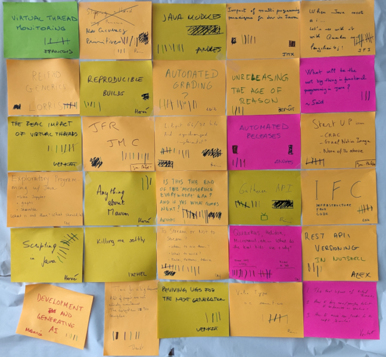
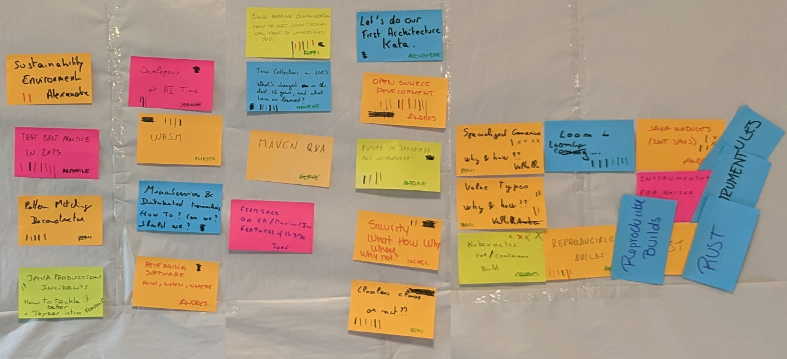

# Schedule

<!-- MACRO{snippet|debug=false|ignoreDownloadError=false|verbatim=false|file=src/site/resources/fragments/breadcrum.snippet.html} -->

## Agenda and Speakers

What is the agenda? Precisely, there is no pre established agenda in an unconference! Who are the speakers? Well, if you feel like it, you will be a speaker!

It does not mean that we don't have great content. With three sessions every morning, and three conference rooms, you will have 9 sessions to choose from 27 proposals. Each conference room is, of course, equipped with video and Wifi.  

These are the agendas of the previous editions. 

JChateau Agenda for 2025:

JChateau Agenda for 2024:

JChateau Agenda for 2023:

## Agenda

Let us talk about the overall agenda of the event. What does a day look like?

JChateau starts Wednesday March the 4th at 7pm. If you arrive earlier than that, there will be someone to chat with you, don't worry.

We will have a little *Pot d'accueil* before dinner. Expect fine local cuisine, local wines, in a friendly and warm ambiance.  

From Thursday to Saturday, we start at 8h30, after breakfast, with a session called the Marketplace. If you have a subject, something you want to talk about or something you want to share, this is the right time to write it down on a post-it note and to pitch it in front of everybody.  

At 9am the 50mn regular sessions start. We have enough space for three indoor sessions in parallel. But if weather permits, you can also have outdoor sessions. Last year some people decided to have sessions while going for a walk nearby. Which is exactly what unconferences are about! Of course, we will have a coffee break. Everybody knows that this is where interesting things are happening!

At 12:30: lunch break. Maybe you will feel like having a theme lunch with people you met in the morning? To continue the conversations you had with them?

The afternoon is dedicated to social events. We are not completely fixed on those. The last years we visited several places: the Château de Chambord, the Château de Cheverny (which has inspired "Moulinsart", the château that Hergé used for Tintin), the Château de Chenonceau, the Château de Blois, built by Charles VIII, and the Clos Lucé, where Leornardo da Vinci spent his last years. With more than 300 castles in the Valley of the Loire, there are plenty of places to visit. 

After one of these, where you will have again plenty of time to chat with people about how Java is great, we will meet for dinner, with more fine cuisine and wines.

The last unconference morning will be Saturday March the 7th. One more social event the Saturday afternoon (we visited wineries in the previous years) and we will have a farewell dinner Saturday night. Checking out the hotel will be Sunday 8th morning.

Current plan are :

### Wednesday 4th

* **18:30 – 19:30** : **Meet the tech, and the people! Float some ideas!**

### Thursday 5th

* **08:30 – 09:00** : **Marketplace**
* **09:00 – 09:45** : **Session 1**
* **10:00 – 10:45** : **Session 2**
* **11:00 – 11:45** : **Session 3**
* **12:00 – 12:30** : **Debrief**
* **Afternoon** :  _excursion to be define_

### Friday 6th

* **08:30 – 09:00** : **Marketplace**
* **09:00 – 09:45** : **Session 1**
* **10:00 – 10:45** : **Session 2**
* **11:00 – 11:45** : **Session 3**
* **12:00 – 12:30** : **Debrief**
* **Afternoon**: _excursion to be define_

### Saturday 7th

* **08:30 – 09:00** : **Marketplace**
* **09:00 – 09:45** : **Session 1**
* **10:00 – 10:45** : **Session 2**
* **11:00 – 11:45** : **Session 3**
* **12:00 – 12:30** : **Debrief**
* **Afternoon** : _excursion to be define_
* **19:30** : farewell dinner. 
